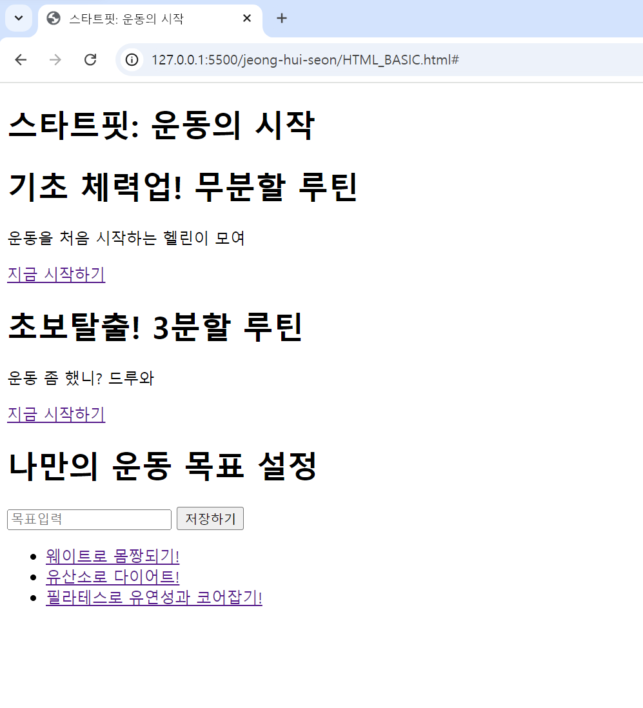
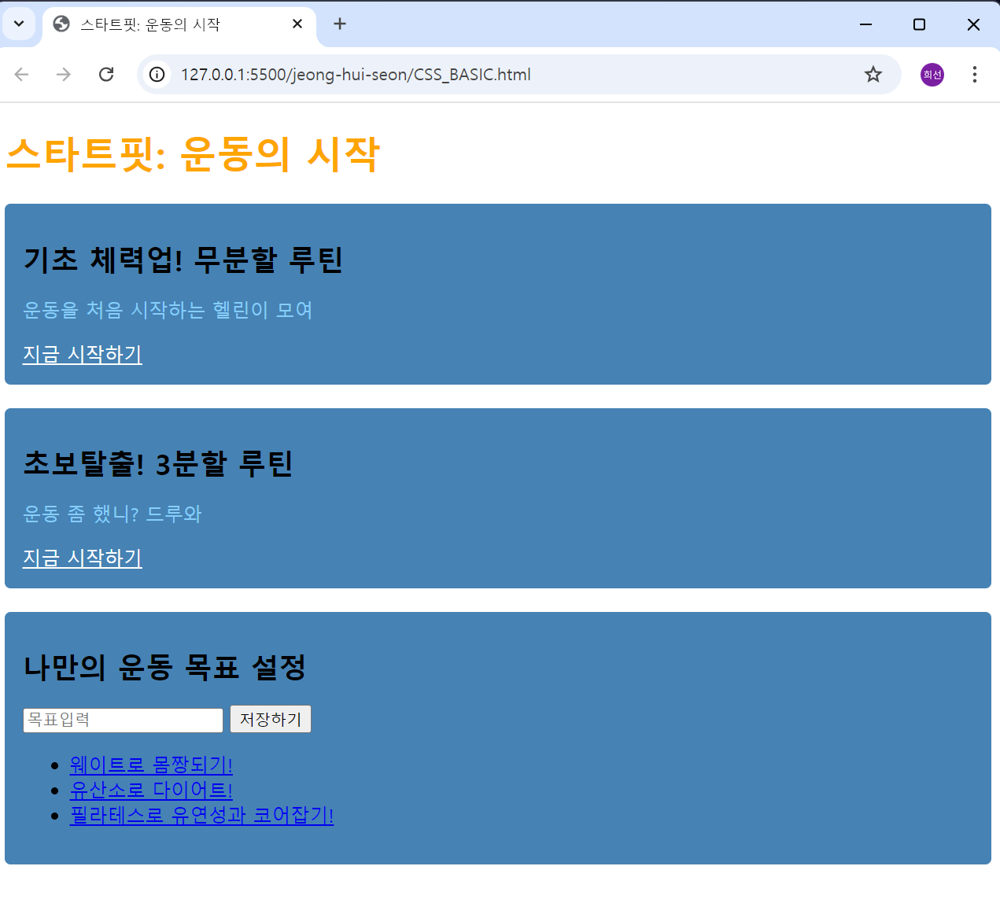

# 이것이 진짜 크롤링이다 - 기본편

### 환경설정
- **Python**: 소스 코드를 해석하고 실행하기 위한 프로그램
- **VS Code**: 소스 코드를 작성할 때 편한 기능들을 제공하는 프로그램
- **Jupyter Notebook**: 셀 단위로 실행할 수 있는 편집 프로그램
    - 커널 선택하기 : 주피터 노트북을 실행할 프로그램을 선택
    - 실행 방법: `Ctrl + Enter` (셀 실행), `Shift + Enter` (셀 실행 후 셀 추가)

### 웹크롤링의 개념과 활용사례
- **웹 크롤링의 개념**: 웹 사이트에 있는 정보를 자동으로 빠르게 수집하는 것
- **웹 크롤링의 활용**
    - 데이터 분석 과정
    - 웹사이트 자동화
    - 인공지능 학습 데이터

> 웹 페이지를 어떻게 볼 수 있을까?

- **HTTP 통신**: 웹 브라우저(크롬, 사파리 등)와 웹 서버(웹 사이트에 대한 정보 제공) 사이에 데이터를 주고 받는데 사용되는 통신
- 웹 서버는 사용자의 요청에 **HTML**로 응답
    - HTML: 페이지에 대한 정보가 들어있음
- 준비물: HTML 기초, CSS 선택자

### 웹사이트 개발의 3요소
1. **HTML**: 구조
2. **CSS**: 디자인
3. **JavaScript**: 동작

- **HTML**: 웹사이트의 구조를 표시하기 위한 언어
- 태그 구조
    - `<태그이름>내용</태그이름>`
    - `<태그이름 속성="속성값">내용</태그이름>`
    - 속성: 태그의 추가적인 정보
    - 내용에는 텍스트나 태그가 들어갈 수 있다.
- 주석: `<!-- 주석처리 -->`

### HTML 기초

```html
<!DOCTYPE html>
<html>
    <head>
        <!-- 문서의 잡다한 정보 -->
        <title>
            스타트핏: 운동의 시작
        </title>
    </head>
    <body>
        <!-- 화면에 표시되는 내용 -->
        <h1>스타트핏: 운동의 시작</h1>

        <div>
            <h1>기초 체력업! 무분할 루틴</h1>
            <p>운동을 처음 시작하는 헬린이 모여</p>
            <a href="https://www.naver.com">지금 시작하기</a>
        </div>

        <div>
            <h1>초보탈출! 3분할 루틴</h1>
            <p>운동 좀 했니? 드루와</p>
            <a href="https://www.naver.com">지금 시작하기</a>
        </div>

        <div>
            <h1>나만의 운동 목표 설정</h1>
            <input type="text" placeholder="목표입력">
            <button onclick="alert('레츠기릿!')">저장하기</button>
            <ul>
                <li><a href="#">웨이트로 몸짱되기!</a></li>
                <li><a href="#">유산소로 다이어트!</a></li>
                <li><a href="#">필라테스로 유연성과 코어잡기!</a></li>
            </ul>
        </div>
    </body>
</html>
```

> 코드 실행 결과


### CSS 선택자
- 선택자: 웹페이지에서 원하는 태그를 선택하는 문법
    - 태그 선택자: 태그 이름으로 선택
    - **클래스 선택자**: 클래스 속성 값으로 선택 (.클래스명)
    - 아이디 선택자: 아이디 속성 값으로 선택하는 것 (#아이디명)
    - ***자식 선택자**: 바로 아래 자식태그를 선택하는 것

```html
<!DOCTYPE html>
<html>
    <head>
        <!-- 문서의 잡다한 정보 -->
         <title>
            스타트핏: 운동의 시작
         </title>
         <style>
            #main-title {color: orange;}
            .sub-title {font-size: 24px;}
            .division {background-color: steelblue; padding: 15px; margin-bottom: 20px; border-radius: 5px;}
            .division > a {color: white;}
            .division > p {color: lightskyblue;}
         </style>
    </head>
    <body>
        <!-- 화면에 표시되는 내용 -->
        <h1 id="main-title">스타트핏: 운동의 시작</h1>

        <div class="division">
            <h1 class="sub-title">기초 체력업! 무분할 루틴</h1>
            <p>운동을 처음 시작하는 헬린이 모여</p>
            <a href="https://www.naver.com">지금 시작하기</a>
        </div>

        <div class="division">
            <h1 class="sub-title">초보탈출! 3분할 루틴</h1>
            <p>운동 좀 했니? 드루와</p>
            <a href="https://www.naver.com">지금 시작하기</a>
        </div>

        <div class="division">
            <h1 class="sub-title">나만의 운동 목표 설정</h1>
            <input type="text" placeholder="목표입력">
            <button onclick="alert('레츠기릿!')">저장하기</button>
            <ul>
                <li><a href="#">웨이트로 몸짱되기!</a></li>
                <li><a href="#">유산소로 다이어트!</a></li>
                <li><a href="#">필라테스로 유연성과 코어잡기!</a></li>
            </ul>
        </div>
    </body>
</html>
```

> 코드 실행 결과


> CSS 퀴즈 사이트
[click here](c:\Users\lissa\AppData\Local\Packages\MicrosoftWindows.Client.CBS_cw5n1h2txyewy\TempState\ScreenClip\{108DBCED-8BA5-4AB5-95FD-8678EC387A9F}.png)

### 웹 크롤링 기초
> 정적 페이지 크롤링: 데이터의 추가적인 변경이 일어나지 않는 페이지 크롤링

- 정적 페이지 크롤링 방법
    - 데이터 받아오기
        - 파이썬에 서버 요청 후 응답받기
        - HTTP 통신으로 HTML 받아오기
    - 데이터 뽑아내기
        - HTML에서 원하는 부분만 추출
        - CSS 선택자를 잘 만드는 것이 핵심

> requests 실습

### 실전 크롤링
1. 한개의 상품 크롤링
2. 여러개의 상품 크롤링
    - 포레스트 이론
        - 숲에서 원하는 정보를 모두 담고 있는 나무를 찾는다.
        - CSS 선택자를 만들어 테스트한다.
        - soup.select()로 숲에서 나무들을 뽑는다.
        - 반복문을 돌며 나무에서 하나씩 열매를 추출한다.
3. 여러 페이지 크롤링
    - URL 조작자
        - URL: 인터넷 주소 형식
        - protocol - domain - path - parameter
    - 페이징 알고리즘
        1. 페이지를 바꾸면서 URL이 변경되는 부분을 찾는다.
        2. 페이지를 증가시키면서 요청을 보낸다.
4. 데이터 엑셀에 저장
    - pandas: 데이터분석 라이브러리
    - openpyxl: 엑셀 자동화 라이브러리
    1. 비어있는 리스트를 만들고 데이터를 한 행씩 추가한다.
    2. 데이터 프레임을 만들고 엑셀로 저장한다.

### 원하는 페이지를 크롤링 해보자.
- 동적 페이지: 데이터의 추가적인 변경이 일어나는 페이지
> 셀리니움 라이브러리